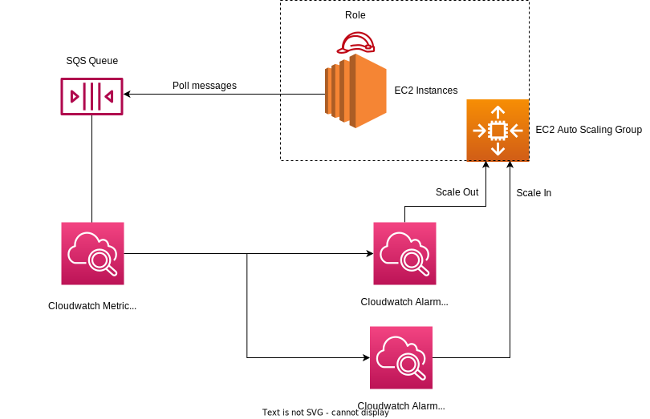

<p align="center"></p>

# Problem
You have an unpredictable system where the amount of data that needs to be processed can substantially increase in a moment. You want your system to:
* auto scale
* scale out to withstand high loads
* scale in to reduce costs when the load is low

# Architectural solution
Auto scale your worker EC2 Instances using an Auto Scaling Group that scales out and in based on two Cloudwatch Alarms that track the "ApproximateNumberOfMessagesVisible", which is the number of messages available for retrieval from the queue.

Two alarms are needed because one indicates high load when the number of unprocessed messages is more than N, and vice versa.

<div style="text-align:center"></div>

# Usage

### Create stack
```
aws cloudformation create-stack \
--stack-name AutoScaleBasedOnQueueStack \
--capabilities CAPABILITY_NAMED_IAM \
--template-body file://./templates/template.yaml \
--parameters \
 ParameterKey=WorkerInstanceImageId,ParameterValue=ami-090fa75af13c156b4 \
 ParameterKey=WorkerInstanceInstanceType,ParameterValue=t2.micro \
 ParameterKey=WorkersASGAvailabilityZones,ParameterValue=us-east-1a \
 ParameterKey=WorkersASGDesiredCapacity,ParameterValue=1 \
 ParameterKey=WorkersASGMaxSize,ParameterValue=2 \
 ParameterKey=WorkersASGMinSize,ParameterValue=1 \
 ParameterKey=DemoQueueNumberOfMessagesAlarmThreshold,ParameterValue=5 \
 ParameterKey=DemoQueueNumberOfMessagesAlarmPeriod,ParameterValue=300 \
 ParameterKey=DemoQueueNumberOfMessagesAlarmEvaluationPeriods,ParameterValue=1
```

### Delete stack
```
aws cloudformation delete-stack \
--stack-name AutoScaleBasedOnQueueStack
```